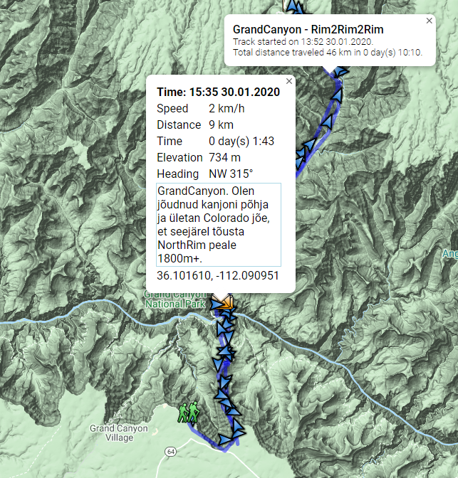
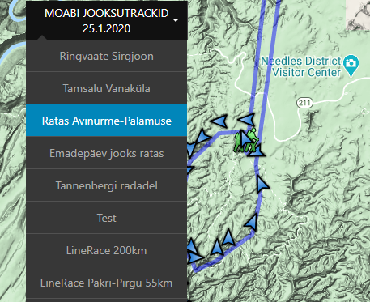
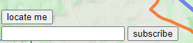
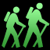
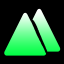
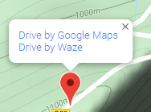
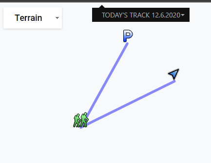
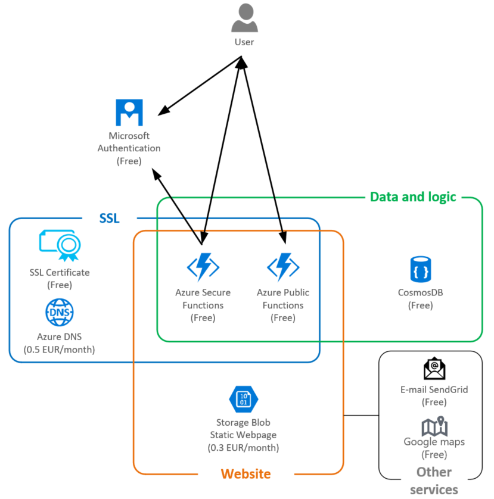

# TrackMe inReach app
#### https://track.ekstreem.ee/
### What is this app?
1. For the peace of mind of my loved ones.
2. To inspire others to dream more, learn more, do more and become more.
3. Intuitive user experience.

Share your Garmin inReach position and messages during your outdoor adventures in near real time.  
Host this website with zero cost using serverless architecture in Azure.
### Public functionality

* People can follow you in the map.
* People can see your inReach messages on the map.
* People can see your track length, duration and starting time.
* People can see each point location, time, distance traveled, speed, duration, heading.
* People can see your historical tracks if defined.  

* People can locate themself on the map. This is useful in cases like this: 
  * If you have a support person then it's very easy to align location in a map,
  * If someone has to find you then it is very easy to undestand how close you are.
* People can subscribe to your Live tracks to get notified by e-mail:
  * If you turn on inReach (Tracking has started)
  * If you send out any inReach messages like "I am in South Pole", "I am having a lunch", "I am camping here" etc.  

* Messages icons on a map are based on keywords found in message.  

|Icon|Keyword found in message|
| ---- | ---- |
||No keyword! Tracking started icon and this cannot be changed.|
||No keyword! Default message icon if inReach message received.|
||camp, campsite, tent, bivouac, laager|
||finish, complete, end, close, parking, stop|
||summit, top, peak, mountain|
||picnic, meal, cooking, bbq, barbeque, cookout|
||beautiful, beauty spot, exciting, nice, great, lovely, pretty, cool|
* People can click everywhere on the map to start navigation with Waze or Google maps.  

### User functionality
* Turn on/off inReach Live tracking in *Today's track*. This track will be resetted every night.  

* Define your own tracks for Live tracking with a customized start-finish date. You can have many parallel tracks for example:
  * One track is a whole expedition with a duration of two months. "Everest 2020 expedition".
  * Other tracks could be like "Approaching into Everest basecamp", "Acclimatization", "Summit days" etc.
* You can publish your tracks even if your Garmin's inReach site is protected by password.
* You can publish historical tracks with a meaningful name, start and finish date.
* You can have your own inReach device which is used as default device for your tracks.
* You can rent or loan inReach from a friend and each your track can have a different device connected.
* You can upload a previously planned track. This is useful in cases like this:
  * People can see visually how far you are on your track.
  * If you have a support person then he/she knows exactly where he/she can meet you.
### Technical Functionality
* If you have multiple parallel tracks then e-mail subscribers get notified only once.
* This application check new points from Garmin in every 5 minutes. Only last point is downloaded from Garmin.
* Up to two day tracks can have detailed points in a map with exact time, speed, distance, duration, heading.
  * This is not enabled for longer tracks as it has great impact on file size loaded into map.
  * Detailed points are arrows which points to the real moving direction.
* User authentication is based on Microsoft Account (Live ID).
* Multi-user application. 

### TrackMe Architecture

